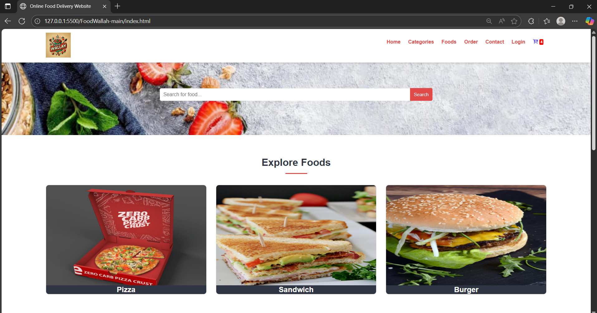

# 🍽️ Food Ordering Web Application


A modern, client-side only web application for food ordering, built with pure HTML, CSS, and JavaScript. This project demonstrates frontend development skills with a focus on responsive design and interactive user experience.

## 🚀 Features

- **Interactive UI** - Smooth animations and transitions
- **Menu Browsing** - Browse food items by categories
- **Cart Simulation** - Add/remove items and adjust quantities
- **Responsive Design** - Works on desktop, tablet, and mobile devices
- **No Backend Required** - Pure frontend implementation

## 🛠️ Technologies Used

- **Frontend**:
  - HTML5
  - CSS3 (with Flexbox and Grid)
  - Vanilla JavaScript (ES6+)
  - Font Awesome Icons

## 🚀 Getting Started

### Prerequisites

- Modern web browser (Chrome, Firefox, Safari, or Edge)
- No server or database required

### Installation

1. **Clone the repository**
   ```bash
   git clone https://github.com/your-username/food-ordering-web.git
   cd food-ordering-web
   ```

2. **Open in Browser**
   - Simply open `index.html` in your preferred web browser
   - Or use a local development server like Live Server in VS Code

3. **Running the Application**
   - No build step required
   - Just open the `index.html` file in any modern web browser


## 🤝 Contributing

Contributions are welcome! Please feel free to submit a Pull Request.

1. Fork the project
2. Create your feature branch (`git checkout -b feature/AmazingFeature`)
3. Commit your changes (`git commit -m 'Add some AmazingFeature'`)
4. Push to the branch (`git push origin feature/AmazingFeature`)
5. Open a Pull Request


## 🙏 Acknowledgments

- [React Icons](https://react-icons.github.io/react-icons/)
- [React Router](https://reactrouter.com/)
- [Axios](https://axios-http.com/)
